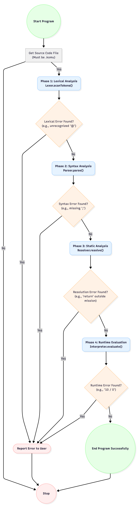

# Komu

Komu is a C++ and Python project designed to provide a modular and extensible framework for parsing, interpreting, and executing `.komu` files. It leverages modern C++ features and libraries to ensure high performance and maintainability.

---

## Flowchart


## ✨ Main Functionality

Komu is a tool for processing `.komu` files, which are custom scripts written in a domain-specific language. The project includes:

- A **parser** for analyzing th syntax `.komu` files.
- An **interpreter** for interpreting and excute the parsed scripts.
- Support for **JSON serialization and deserialization** using the `nlohmann::json` library.
- Examples and tests to demonstrate and validate its functionality.

---

## 📂 Project Structure

- **`CMakeLists.txt`**: Configuration file for building the project.
- **`src/`**: Contains the main source code of the project.
- **`examples/`**: Includes example `.komu` files to demonstrate usage.
- **`tests/`**: Unit and integration tests for ensuring code quality.
- **`scripts/`**: Helper scripts for building, formatting, and running `.komu` files.
- **`.gitignore`**: Specifies files and directories ignored by Git.

---

## 🛠 Requirements

To build and run Komu, ensure the following dependencies are installed:

- A **C++ compiler** with C++17 (or newer) support (e.g., GCC 7+, Clang 5+, MSVC 2017+)
- **Python 3** for running parser-related tests
- **CMake** (version 3.10 or higher recommended) for project configuration and build
- The **nlohmann::json** library for JSON parsing and serialization (included as a dependency)
- **Git** (optional) for version control and cloning the repository
- **CTest** and **Pytest** for running unit and integration tests


---

## 📖 Detailed Explanation of `nlohmann::json` Usage

The `nlohmann::json` library is used in Komu for:

- **Parsing JSON input**: Reading and interpreting JSON data structures.
- **Serializing output**: Converting internal data structures into JSON for storage or communication.
- **Configuration management**: Handling project configurations stored in JSON format.

The library simplifies working with JSON by providing a clean and intuitive API. For example:

```cpp
#include <nlohmann/json.hpp>

// Create a JSON object
nlohmann::json data = {
    {"name", "Komu"},
    {"version", 1.0},
    {"features", {"parsing", "interpreting", "executing"}}
};


// Access data
std::string name = data["name"];
double version = data["version"];
```

---

## 🚀 Building the Project

Follow these steps to build Komu:

1. **Create a build directory** and configure the project:
   ```bash
   mkdir -p build
   cd build
   cmake ..
   ```

2. **Build the project**:
   ```bash
   cmake --build . --config Release
   ```

3. **(Optional) Run tests**:
   ```bash
   ctest --output-on-failure
   # or
   cmake --build . --target test
   ```

---

---

## 🧪 Running Tests

To ensure the project works as expected, run the tests:

### Using `ctest` (for interpreter tests):
```bash
ctest --output-on-failure
```


### Using `pytest` (for parser tests):
```bash
pytest tests/parser
```

The tests cover the following areas:

- **Parser tests**: Validate the correctness of `.komu` file parsing using `pytest`.
- **Interpreter tests**: Ensure proper execution of parsed scripts using `ctest`.

## 📖 Examples

The `examples/` directory contains `.komu` files that demonstrate Komu's functionality:

- **`examples/test.komu`**: A comprehensive test file showcasing variables, arithmetic, loops, functions, and recursion.
- **`examples/hello_world.komu`**: A simple "Hello, World!" example to get started.

To run an example, use the `compile.sh` script:

```bash
./scripts/compile.sh examples/test.komu
```

---

## 📜 Scripts

The `scripts/` directory contains helper scripts:

- **`compile.sh`**: Dynamically runs `.komu` files from the terminal.
  - Usage: `./scripts/compile.sh <filename.komu>`
- **`run_test.sh`**: run the test files.
  - Usage: `./scripts/run_test.sh`
- **`build.sh`**: Automates the build process for the project.

---

## 📦 Build Output

After building the project, the following outputs are generated:

- **Executable**: The main program for running `.komu` files.
- **Test binaries**: Executables for running unit and integration tests.

The build artifacts are located in the `build/` directory.

---

## 🤝 Contributing

We welcome contributions to Komu! Here's how you can help:

1. Open an issue to discuss your planned changes.
2. Create a pull request targeting the `main` branch.
3. Keep your changes focused and include tests where applicable.

---

## 📄 License

This repository currently does not include a license file. If you are the repository owner, consider adding a `LICENSE` file to clarify the project's licensing terms.

---

## 👤 Maintainer

- GitHub: [alyastanga](https://github.com/alyastanga)

---

Thank you for using Komu! If you encounter any issues or have suggestions, feel free to open an issue on GitHub.